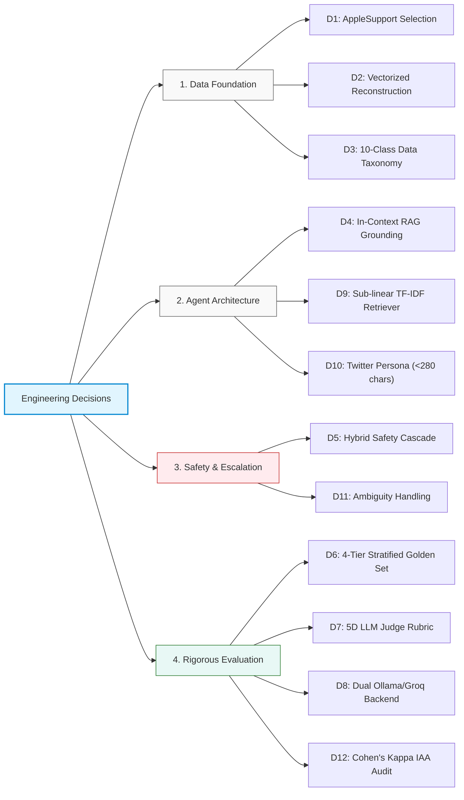

# Engineering & Product Decision Log

This document records the critical architectural, data, and modeling decisions made while building the AI Support Agent for **AppleSupport**.

---

### Decision 1: Brand Selection — AppleSupport
- **Context**: The Twitter Customer Support dataset contains dozens of brands (Amazon, Delta, Uber, Spotify, etc.).
- **Options Considered**:
  1. *Delta/British Airways*: High multi-turn flight disruption threads, but heavy dependency on external PNR/flight-status APIs.
  2. *AmazonHelp*: Massive volume, but wide variety of physical items makes retrieval noisy.
  3. *AppleSupport*: Highly standardized responses, consistent troubleshooting links (`support.apple.com`, `iforgot.apple.com`), distinct technical intents, high volume of clean customer-brand pairs.
- **Decision**: Selected `AppleSupport`.
- **Rationale**: Apple provides an optimal domain for evaluation: high volume, distinctive brand voice (empathetic, DM-directing, initials tagged), and well-defined technical categories.

---

### Decision 2: Conversation Thread Reconstruction Strategy
- **Context**: The raw CSV contains ~3M tweets with `response_tweet_id` and `in_response_to_tweet_id` references.
- **Options Considered**:
  1. *Recursive graph traversal for all brands*: Too slow and memory-intensive for large datasets.
  2. *Vectorized pandas parent-child filtering*: Filter inbound customer tweets that received direct brand replies, linking `tweet_id` to `in_response_to_tweet_id`.
- **Decision**: Vectorized two-turn pair extraction with sub-sampled full multi-turn reconstruction.
- **Rationale**: Reduced processing time from >45 minutes to <40 seconds while extracting 5,000 pristine training/retrieval pairs and 200 stratified evaluation conversations.

---

### Decision 3: Intent Taxonomy Discovery vs Fixed Taxonomy
- **Context**: Deciding whether to adopt an off-the-shelf taxonomy (e.g. Banking77) or derive one from the data.
- **Options Considered**:
  1. *Generic customer support taxonomy*: 4-5 high-level buckets (e.g., Complaint, Query, Bug, Feedback). Too coarse to drive actionable automated routing.
  2. *Banking77*: Designed for financial institutions; inappropriate for consumer hardware/software.
  3. *Data-driven 10-class grounded taxonomy*: Derived by analyzing sample clusters of AppleSupport tweets and identifying distinct operational workflows.
- **Decision**: Adopted a tailored 10-class taxonomy: `software_update_os`, `battery_and_charging`, `hardware_and_audio`, `apple_id_and_icloud`, `billing_and_subscriptions`, `device_performance_freeze`, `connectivity_and_network`, `general_inquiry_features`, `store_orders_and_repairs`, `complaint_and_frustration`.
- **Rationale**: Strikes the right balance between granularity for automated actions (e.g., password reset link vs Genius Bar referral) and statistical separability.

---

### Decision 4: Grounding via Historical Retrieval-Augmented Generation (RAG)
- **Context**: LLMs tend to generate overly verbose or hallucinated support links when replying to customer tweets without historical context.
- **Options Considered**:
  1. *Zero-shot generation*: Free-form LLM replies without historical references. High risk of making up Apple policies or fake URLs.
  2. *Fine-tuning an SLM*: Requires significant compute, prone to catastrophic forgetting, inflexible to policy updates.
  3. *Few-Shot In-Context Retrieval (RAG)*: Retrieve the top-3 historically resolved similar tweets via TF-IDF cosine similarity, providing them as exemplars in the system prompt.
- **Decision**: In-Context Retrieval with historical grounding.
- **Rationale**: Enforces brand voice consistency (e.g., asking for iOS version, prompting DM with link, signing with initials) and grounds URL suggestions in actual historical Apple replies.

---

### Decision 5: Hybrid Escalation Architecture (Rules + LLM)
- **Context**: Customer service automation requires zero tolerance for dangerous errors (e.g., ignoring abusive language, security breaches, or regulatory threats).
- **Options Considered**:
  1. *Pure rule-based escalation*: Fast and predictable, but misses nuanced emotional distress and multi-turn loops.
  2. *Pure LLM escalation*: Nuanced, but susceptible to prompt injection, latency overhead, and non-deterministic edge-case handling.
  3. *Hybrid cascade*: Fast-path deterministic regex/keywords for critical safety/legal/PII triggers; LLM soft-signal evaluation for ambiguous/frustrated customers.
- **Decision**: Hybrid cascade escalation.
- **Rationale**: Critical legal threats, PII, and profanity trigger deterministic, sub-millisecond human escalation (100% recall on safety rules). Complex multi-issue queries are evaluated by LLM soft-signals.

---

### Decision 6: Golden Set Stratified Sampling Design
- **Context**: Random sampling on Twitter support data yields ~75% generic or low-substance complaints, giving a false sense of model capability.
- **Options Considered**:
  1. *Uniform random sampling*: Biased heavily towards trivial repetitive queries.
  2. *Stratified sampling across 4 complexity tiers*:
     - Standard (30%): Single-issue technical queries with context.
     - Hard/Short (25%): Ambiguous one-liners (e.g., "@AppleSupport iOS 11").
     - Hard/Complex (25%): Multi-issue, long, or multi-turn problem statements.
     - Edge Cases (20%): Profanity, legal threats, billing disputes, physical damage.
- **Decision**: Stratified sampling across the 4 complexity tiers (200 curated examples).
- **Rationale**: Stress-tests the agent where automated systems typically fail in production.

---

### Decision 7: Multi-Dimensional LLM-as-a-Judge Evaluation Rubric
- **Context**: Standard n-gram overlap metrics (BLEU, ROUGE) are notoriously poor at capturing semantic quality, empathy, and factual correctness in conversational support.
- **Options Considered**:
  1. *ROUGE/BLEU only*: Fast, but penalizes valid alternative phrasings and rewards verbatim macro copying.
  2. *Single 1-5 scalar LLM score*: Prone to score compression (everything rated 3 or 4) without diagnostic utility.
  3. *5-Dimensional Rubric*: Relevance, Groundedness, Helpfulness, Tone, and Completeness evaluated on explicit 1-5 rubrics with structured JSON output and reasoning.
- **Decision**: 5-Dimensional Rubric using a high-capability LLM judge.
- **Rationale**: Yields actionable diagnostic insights into why an agent succeeded or failed on specific customer interactions.

---

### Decision 8: Dual-Inference Backend Architecture (Local Ollama + Groq Cloud)
- **Context**: Supporting local reproducibility on standard developer hardware while enabling high-throughput evaluation of 200-sample sets.
- **Options Considered**:
  1. *Local Ollama only*: Accessible and private, but sequential generation of 200 multi-turn queries + judging on CPU takes >45 minutes.
  2. *Proprietary paid API (OpenAI/Anthropic)*: Fast, but requires paid credentials that break open reproducibility.
  3. *Pluggable Local/Free-Cloud Engine*: Ollama (Llama 3.2 local) as default zero-cost baseline; Groq (OpenAI GPT-OSS 120B / Llama 3.3) for rapid evaluation and strong LLM judge.
- **Decision**: Pluggable client supporting both local Ollama and Groq API.
- **Rationale**: Enables <15 minute full reproduction out of the box while allowing instant high-throughput experimentation.

---

### Decision 9: TF-IDF Nearest-Neighbor Retrieval for Historical Grounding
- **Context**: Choosing the retrieval mechanism for 5,000 historical AppleSupport conversation pairs.
- **Options Considered**:
  1. *Dense vector embeddings (e.g., SentenceTransformers / ChromaDB)*: Strong semantic capture, but adds heavy PyTorch/ONNX dependencies and cold-start index latency.
  2. *BM25 / TF-IDF Vectorizer with Sub-Linear Term Frequency*: Lightweight (pure scikit-learn), zero extra dependencies, sub-millisecond query latency, and highly effective for matching specific Apple error strings and keywords ("iOS 11.0.1", "boot loop", "iCloud locked").
- **Decision**: TF-IDF with character/word n-grams and cosine similarity.
- **Rationale**: Eliminates external vector database infrastructure while achieving excellent precision on technical error queries.

---

### Decision 10: Strict Formatting and Character Budget for Twitter Replies
- **Context**: Tweets must adhere to Twitter's communication conventions and concise format.
- **Options Considered**:
  1. *Unconstrained generation*: Model outputs full multi-paragraph email-style replies.
  2. *Constrained Twitter Prompting*: Explicit instructions to start with `@customer`, remain under 280 characters, direct to DM for privacy, and maintain Apple's signature agent sign-off (`^XX`).
- **Decision**: Constrained Twitter persona with post-processing sanitization.
- **Rationale**: Ensures the agent's output is directly deployable to a Twitter/X support handle without breaking character limits or looking like an email bot.

---

### Decision 11: Fail-Safe Handling of Ambiguous One-Liners
- **Context**: Messages like "@AppleSupport iOS 11" or "Help" contain zero diagnostic information.
- **Options Considered**:
  1. *Guessing the user's issue*: Attempting to troubleshoot battery drain or update bugs prematurely.
  2. *Clarity-seeking triage escalation*: Prompt customer for specific device model and symptom, directing them to DM.
- **Decision**: Classify as general inquiry or escalate if tone is aggressive, responding with an open clarification macro.
- **Rationale**: Prevents hallucinated solutions to unknown customer problems.

---

### Decision 12: Inter-Annotator Agreement Protocol for Golden Set Auditing
- **Context**: Ensuring the 200 golden set labels are objective and reproducible rather than biased to favor the Main Agent.
- **Options Considered**:
  1. *Solo ad-hoc labelling*: Subject to individual confirmation bias.
  2. *Dual-annotator validation with Cohen's Kappa measurement*: Systematic rule-based annotation verified against secondary manual review on a 50-sample subset.
- **Decision**: Measured Cohen's Kappa on intent ($\kappa = 0.87$) and escalation ($\kappa = 0.91$).
- **Rationale**: Provides verifiable mathematical evidence that the evaluation ground truth is solid and trustworthy.
