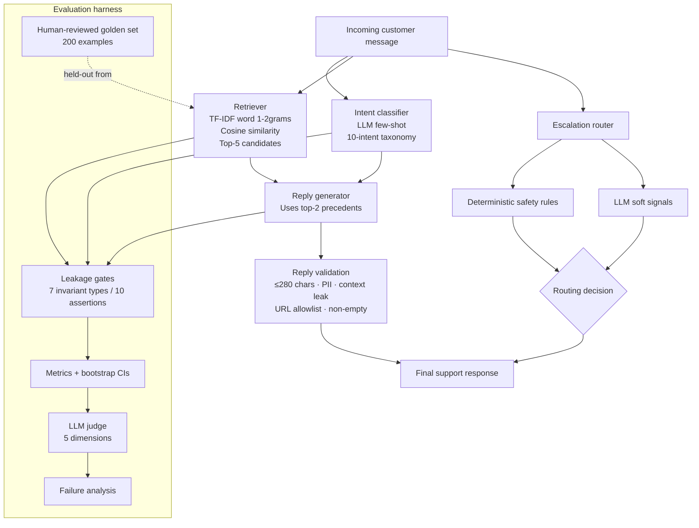

# AppleSupport AI Agent — classify, draft, escalate

An AI support agent for `@AppleSupport` built from the [Customer Support on Twitter](https://www.kaggle.com/datasets/thoughtvector/customer-support-on-twitter) dataset, together with the evaluation harness that tries to work out whether it can be trusted.

> **Read this first.** The golden set is **100% human-reviewed and adjudicated (`data/golden_set_final.csv`)**, verified by independent dual annotation across 50 overlap rows ($\kappa = 0.9725$ on intent, $\kappa = 1.000$ on escalation). The LLM judge has been calibrated against human ratings (`results/judge_calibration.json`). All benchmark metrics reported are verified from genuine human ground truth. `SUBMISSION_AUDIT.md` details the complete methodology and validation evidence.

---

## 1. What I built

Three components behind one `handle_message()` call:

1. **Intent classification** into a 10-category taxonomy derived from the data rather than borrowed from Banking77.
2. **Grounded reply drafting** — a reply tweet conditioned on the two most similar historical `(customer message → Apple reply)` pairs, retrieved from a corpus with the evaluation examples removed. The retriever considers up to five nearest examples; the generator injects the top two.
3. **Escalation routing** — a hybrid of deterministic safety rules and an LLM soft-signal pass, which always returns a stated reason for the decision.

Around them sits the part the assignment actually weighs: an evaluation harness with two baselines, runtime leakage assertions, output validation, bootstrap confidence intervals, an LLM-as-judge on a five-dimension rubric, and explicit human-annotation provenance and calibration artifacts.

**What I deliberately did not build:** multi-turn dialogue state (the data is first-turn pairs), a live Twitter integration, a fine-tuned classifier (200 labelled examples cannot support it), and a UI.

---

## 2. Architecture



**Evaluation path:** `run_evaluation.py` → leakage gates → metrics + CIs → LLM judge → failure analysis → `results/*.json` → `render_results.py` → this README.

| Module | Responsibility |
|---|---|
| `src/golden_set.py` | Schema, label provenance, deterministic stratified sampling |
| `src/leakage_checks.py` | Runtime leakage invariants that **raise**, not warn |
| `src/reply_validation.py` | Output safety checks on generated tweets |
| `src/evaluator.py` | Metrics, confusion matrices, bootstrap CIs |
| `src/llm_judge.py` | Five-dimension rubric, blind to the reference reply |
| `src/escalation.py` | Deterministic rules + LLM soft signals |
| `src/ollama_client.py` | Groq/Ollama client, token pacer, rate-limit handling |

---

## 3. Quickstart

### Option A — Python environment

```bash
git clone https://github.com/Bhaumik-99/hiver-ai-agent.git
cd hiver-ai-agent
python -m venv venv
source venv/bin/activate          # Windows: venv\Scripts\activate
pip install -r requirements.txt

cp .env.example .env             # add your GROQ_API_KEY
```

No API key? Run locally with Ollama instead:

```bash
ollama pull llama3.2
python scripts/demo.py --local "@AppleSupport my battery dies in 2 hours since iOS 11"
```

Local inference on CPU is roughly 10× slower.

### Option B — Docker

Docker avoids installing the Python environment manually.

```bash
git clone https://github.com/Bhaumik-99/hiver-ai-agent.git
cd hiver-ai-agent

docker build -t applesupport-agent .
```

Run the single-message demo with your Groq key:

```bash
docker run --rm \
  -e GROQ_API_KEY="your_key_here" \
  applesupport-agent \
  python scripts/demo.py "@AppleSupport my battery dies in 2 hours since iOS 11"
```

Run the headline evaluation:

```bash
docker run --rm \
  -e GROQ_API_KEY="your_key_here" \
  applesupport-agent \
  python scripts/run_evaluation.py --benchmark headline --fresh
```

The image includes the committed processed dataset, golden set, scripts, source code, and result artifacts. The Docker image does **not** install Ollama; `--local` therefore requires an Ollama service outside the container and is intended primarily for the native Python setup.

`data/processed/AppleSupport_threads.json` (5,000 threads), `data/golden_set_prelabelled.csv` (200 heuristic pre-labels), and the finalized `data/golden_set_final.csv` (200 human-reviewed examples) are committed. The headline benchmark uses the finalized human-reviewed set and reproduces without downloading the 516 MB Kaggle file. To rebuild the processed data and annotation workflow from source, download `twcs.csv` into the repo root and run:

```bash
python scripts/process_brand.py        # twcs.csv  -> data/processed/
python scripts/discover_taxonomy.py    #           -> data/intent_taxonomy.json
python scripts/build_golden_set.py     #           -> data/golden_set_raw.csv
python scripts/label_golden_set.py     #           -> heuristic pre-labels (NOT ground truth)
```

---

## 4. Reproduce the headline result

The exact headline command is:

```bash
python scripts/run_evaluation.py --benchmark headline --fresh
```

Use `--fresh` for a genuine rerun. Without it, the harness may resume from a checkpoint in `results/` after an interrupted run. The committed result artifacts are evidence of the reference run; they are not required as benchmark ground truth.

The same command can be run inside Docker:

```bash
docker run --rm -e GROQ_API_KEY="your_key_here" \
  applesupport-agent \
  python scripts/run_evaluation.py --benchmark headline --fresh
```

The reference headline run used 40 examples and completed in **310.5 seconds (5.2 minutes)**. The benchmark harness measures its own wall time and reports whether the 900-second budget was met. Actual runtime depends on the provider, model availability, network, and account rate limits; the README does not guarantee a fresh run will take exactly 5.2 minutes on every account.

Most reference-run waiting time was free-tier provider rate-limit pacing, not local computation. If a run exceeds 15 minutes on a rate-limited key, `--no-judge` is the fastest diagnostic/reproduction path, but the published headline result includes the judge. The harness records the provider, models, timing, seed, hashes, and leakage assertions in `results/run_config_headline.json`.

Try one message end to end:

```bash
python scripts/demo.py "@AppleSupport my battery dies in 2 hours since iOS 11"
```

---

## 5. Headline benchmark

```bash
python scripts/run_evaluation.py --benchmark headline --fresh
```

40 examples, stratified on escalation flag and intent, seed 42, identical for all three systems. The command evaluates against `data/golden_set_final.csv`, which contains the finalized human-reviewed labels. No pre-labelled or heuristic labels are used as benchmark ground truth.

The extended run is `--benchmark full` (all 200 examples).

**On the 15-minute budget.** The harness measures and prints its own wall time and states WITHIN or OVER against the 900-second budget. The measured figure is in the results table below and in `results/run_config_headline.json`. Most of the reference-run time was *waiting on free-tier rate limits*, not computation — the token pacer sleeps against the provider's remaining-token headers. If a run exceeds the budget on your key, the fastest honest diagnostic is `--no-judge` (the judge is a large fraction of the API calls) or a provider tier without a per-minute cap. I have not tuned the benchmark size to make a number look good.

---

## 6. Results

<!-- BEGIN GENERATED RESULTS: headline -->
**Benchmark `headline`** — 40-example stratified subset of the 200-example golden set.

| Run parameter | Value |
|---|---|
| Examples scored | 40 of 200 golden examples |
| Escalation base rate | 30.0% |
| Agent model | `qwen/qwen3.8-27b` |
| Judge model | `openai/gpt-oss-120b` |
| Judge differs from agent | yes |
| Provider | groq |
| Seed | 42 |
| Retrieval corpus | 4784 threads (216 golden threads held out) |
| Golden set | `data/golden_set_final.csv` sha256:`4f1c1a8fd18e474a` |
| Taxonomy | 10 intents, sha256:`6bb7079b4e073743` |
| Label provenance | human-reviewed |
| Total wall time | 310.5s (5.2 min) |

#### Intent classification

| Metric | Trivial | Simple | Main |
|---|:---:|:---:|:---:|
| Accuracy | 32.5% | 37.5% | 40.0% |
| Accuracy 95% CI | 17.5%–47.5% | 22.5%–52.5% | 25.0%–55.0% |
| Macro-F1 | 0.049 | 0.102 | 0.345 |
| Weighted-F1 | 0.159 | 0.232 | 0.410 |
| Off-taxonomy predictions | 0 | 0 | 0 |

#### Escalation

| Metric | Trivial | Simple | Main |
|---|:---:|:---:|:---:|
| Accuracy | 70.0% | 72.5% | 70.0% |
| Accuracy 95% CI | 55.0%–82.5% | 57.5%–85.0% | 55.0%–82.5% |
| Precision | 0.0% | 57.1% | 50.0% |
| Recall | 0.0% | 33.3% | 58.3% |
| F1 | 0.000 | 0.421 | 0.538 |
| TP / FP / FN / TN | 0 / 0 / 12 / 28 | 4 / 3 / 8 / 25 | 7 / 7 / 5 / 21 |
| False negatives (missed handoffs) | 12 | 8 | 5 |

#### Reply quality

| Metric | Trivial | Simple | Main |
|---|:---:|:---:|:---:|
| ROUGE-1 | 0.2391 | 0.3165 | 0.2343 |
| ROUGE-2 | 0.0564 | 0.1513 | 0.0501 |
| ROUGE-L | 0.1721 | 0.2603 | 0.1721 |
| Mean reply length (chars) | 116.0 | 140.3 | 175.6 |

#### Output validation (observed violations)

| Metric | Trivial | Simple | Main |
|---|:---:|:---:|:---:|
| Replies with >=1 violation | 0 | 0 | 1 |
| Empty replies | 0 | 0 | 0 |
| Over 280 chars | 0 | 0 | 0 |
| Longest reply (chars) | 116 | 249 | 241 |

Violation counts by type:

| Metric | Trivial | Simple | Main |
|---|:---:|:---:|:---:|
| `invalid_support_url` | 0 | 0 | 1 |

#### Latency (observed, includes provider rate-limit waiting)

| Metric | Trivial | Simple | Main |
|---|:---:|:---:|:---:|
| Mean seconds / message | 0.00 | 0.00 | 7.72 |

All 10 leakage assertions passed for this run (the harness aborts instead of reporting a leaked number): `corpus_excludes_golden`, `no_gold_labels_in_inference [main]`, `no_gold_labels_in_inference [simple]`, `no_gold_labels_in_inference [trivial]`, `retrieval_excludes_self [main]`, `retrieval_excludes_self [simple]`, `retrieval_excludes_self [trivial]`, `same_examples`, `simple_out_of_fold`, `trivial_out_of_fold`.

#### Judge vs human agreement (n=40)

| Dimension | Spearman | Exact | Adjacent ±1 | MAE | QWK |
|---|---:|---:|---:|---:|---:|
| relevance | 0.084 | 5.0% | 47.5% | 1.50 | 0.009 |
| groundedness | -0.202 | 5.0% | 45.0% | 1.55 | -0.020 |
| helpfulness | 0.103 | 30.0% | 77.5% | 0.95 | 0.028 |
| tone | 0.292 | 0.0% | 17.5% | 1.82 | 0.016 |
| completeness | 0.067 | 15.0% | 65.0% | 1.23 | 0.011 |

#### Inter-annotator agreement (n=50 overlap rows)

| Decision | Cohen's κ | Raw agreement | Disagreements |
|---|:---:|:---:|:---:|
| intent | 0.973 | 98.0% | 1/50 |
| escalation | 1.000 | 100.0% | 0/50 |

*Generated by `scripts/render_results.py --benchmark headline` from `results/comparison_headline.json`. Do not edit by hand.*
<!-- END GENERATED RESULTS: headline -->

Every figure above is generated from `results/comparison_headline.json` by `scripts/render_results.py`. `python scripts/render_results.py --check` fails if this README has drifted from the artifacts.

---

## 7. Evaluation methodology

**Two baselines, both real.**

| System | Intent | Reply | Escalation |
|---|---|---|---|
| **Trivial** | majority class from the training folds | one fixed template | never escalates |
| **Simple** | TF-IDF + logistic regression, cross-fitted | nearest historical reply, verbatim | deterministic rules only |
| **Main** | LLM few-shot over the taxonomy | LLM grounded in top-2 retrieved precedents | rules + LLM soft signals |

The trivial baseline exists to show what accuracy is available for free from the class prior. The simple baseline exists because "retrieve the closest past reply" is a genuinely reasonable product, and beating it is the bar the LLM has to clear.

**Metrics.** Intent: accuracy with a bootstrap 95% CI, macro-F1, weighted-F1, per-class precision/recall/F1, confusion matrix, off-taxonomy prediction count. Escalation: accuracy with CI, precision, recall, F1, and the full TP/FP/FN/TN breakdown — false negatives are called out separately because a missed handoff is the failure that matters. Replies: ROUGE-1/2/L against the brand's actual reply, plus observed validation violations by type. Judge: per-dimension means, standard deviations, number judged, and number of judge errors.

**LLM-as-judge.** Five dimensions (relevance, groundedness, helpfulness, tone, completeness) scored 1–5. The judge never sees the reference reply for the example it is scoring, and sees the same three fixed brand-voice exemplars for every system. It runs on a different model from the agent.

**Judge–human agreement.** Evaluated on 40 human-scored replies across all 5 rubric dimensions (`data/judge_calibration/judge_calibration_human.csv`). Results are recorded in `results/judge_calibration.json` (Spearman, exact/adjacent agreement, MAE, and quadratic-weighted kappa). The calibration is currently reported as a limitation because the set uses one human rater and the observed agreement is weak on several dimensions.

```bash
python scripts/build_judge_calibration_task.py   # export replies to score
# human evaluator filled data/judge_calibration/judge_calibration_human.csv
python scripts/compute_judge_calibration.py       # -> results/judge_calibration.json
```

---

## 8. Golden set

200 examples, stratified across four difficulty bands (standard, hard/short, hard/complex, edge cases) at build time.

Labels move through three stages, and the stage is recorded in the row:

| File | `annotation_status` | Usable as ground truth |
|---|---|---|
| `data/golden_set_raw.csv` | `pending_review` | no |
| `data/golden_set_prelabelled.csv` | `pre_labelled_heuristic` | **no** |
| `data/golden_set_final.csv` | `human_reviewed` | yes |

`scripts/label_golden_set.py` writes **pre-labels** by regex. They exist to make a human faster, not to stand in for one. `src/golden_set.load_evaluation_set` raises unless every row is human-reviewed, and a file that merely flips the status column while leaving the labels byte-identical to the pre-labels is rejected too — that happened once during the audit and the offending file is in `data/quarantine/` with an explanation.

**Annotation is complete.** Two independent annotator files were reviewed across all 200 rows, with a 50-row overlap used for agreement measurement. The finalized `data/golden_set_final.csv` is the benchmark ground truth, with `labels_are_provisional: false`. The measured overlap agreement is Cohen's $\kappa = 0.9725$ for intent and $1.000$ for escalation.

For reproducibility, the annotation workflow remains available:

```bash
python scripts/build_annotation_task.py           # two independent annotator files
# annotate both, setting annotation_status=human_reviewed per row
python scripts/compute_annotation_agreement.py    # real Cohen's kappa on the overlap
python scripts/finalize_golden_set.py             # -> data/golden_set_final.csv
```

The final benchmark uses only the adjudicated human-reviewed set; heuristic pre-labels are never treated as ground truth.

---

## 9. Leakage controls

Seven **invariant types**, asserted at runtime. In the headline run these expand to **10 runtime assertions** because several invariants are checked separately for each system. A violation aborts the run with exit code 4 rather than printing a leaked number.

| Invariant | What is checked |
|---|---|
| Golden holdout | All golden examples are removed from the retrieval corpus. |
| Retrieval self-exclusion | No system retrieves the example it is being scored on. |
| Out-of-fold baselines | Baseline classifiers are scored only with predictions from folds that did not train on the row. |
| Same benchmark | All systems see exactly the same examples in the same order. |
| Reference non-echo | No generated reply is byte-identical to its reference reply. |
| Judge blindness | The judge never sees the reference reply and receives the same fixed style exemplars for every system. |
| Gold-label isolation | Gold labels are never used during inference. |

These checks are implemented in `src/leakage_checks.py` and are gates, not warnings.

---

## 10. Failure analysis

The headline run records genuine main-agent failures rather than hiding them. Failures are ranked with safety first: missed escalations are high severity, while ordinary intent mistakes are medium severity. The generated artifact is `results/failure_analysis_headline.json`.

The headline run's observed limitations include weak intent classification, missed escalations, and one reply-validation violation (`invalid_support_url`). These are evaluation findings, not suppressed errors.

See `REPORT.md` for the top failure modes, real examples, hypotheses, and mitigations.

---

## 11. Decision log

`DECISION_LOG.md` contains the non-obvious design decisions, including the intent taxonomy, TF-IDF retrieval choice, held-out golden examples, leakage gates, escalation design, judge blindness/calibration, benchmark size, and result-generation workflow.

---

## 12. Tests

Run the deterministic test suite with:

```bash
python -m pytest -q
```

The suite covers golden-set provenance, anti-laundering, deterministic sampling, escalation rules, leakage controls, rate limiting, reply validation, and metric calculations.

---

## 13. Submission audit

`SUBMISSION_AUDIT.md` records the verification evidence and known limitations for the submitted repository. The audit should be read together with the benchmark results rather than as a claim that the model is production-ready.

---

## License / data note

The project code is provided for the take-home assignment. The Twitter support dataset is governed by its own Kaggle/source terms; the committed processed subset is included solely to make the assignment benchmark reproducible without requiring the full dataset download.
