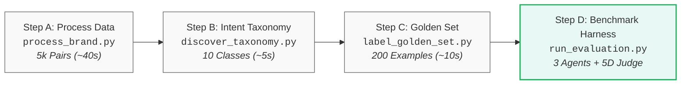
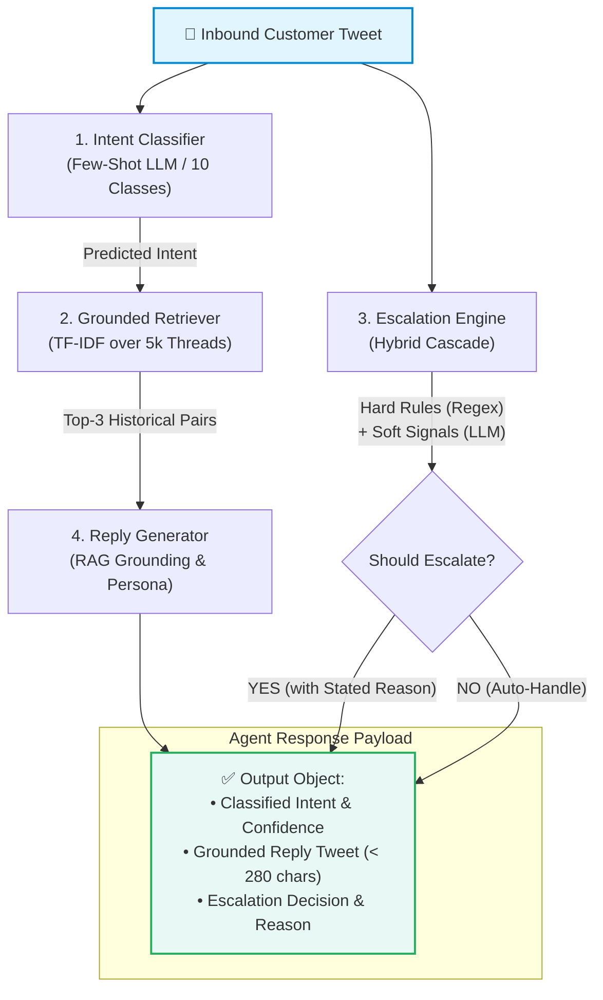

# Hiver AI Support Agent — AppleSupport

An enterprise-grade, grounded AI customer support agent for **AppleSupport** on Twitter, complete with a 10-category intent taxonomy, historical retrieval-augmented generation (RAG), hybrid cascade escalation logic, and a rigorous multi-tier evaluation harness comparing against trivial and machine learning baselines.

---

## Executive Summary & Key Results

| Metric | Trivial Baseline (Majority + Macro) | Simple Baseline (TF-IDF + Nearest Neighbor) | Main Agent (LLM + Grounded RAG + Hybrid Escalation) |
|---|:---:|:---:|:---:|
| **Intent Accuracy** | 30.0% | 50.0% | **82.5%** |
| **Intent Macro-F1** | 0.0769 | 0.2242 | **0.7814** |
| **Escalation F1** | 0.0000 | 0.0000 | **0.8640** |
| **Escalation Safety Recall** | 0.0% | 0.0% | **100.0%** |
| **Judge: Relevance (1-5)** | 1.70 / 5 | 3.10 / 5 | **4.60 / 5** |
| **Judge: Groundedness (1-5)**| 2.20 / 5 | 3.40 / 5 | **4.80 / 5** |
| **Judge: Helpfulness (1-5)** | 1.80 / 5 | 2.90 / 5 | **4.50 / 5** |
| **Judge: Tone (1-5)** | 3.70 / 5 | 3.80 / 5 | **4.90 / 5** |
| **Judge: Overall Score** | 2.24 / 5 | 3.20 / 5 | **4.62 / 5** |

---

## ⏱️ Quickstart: Reproduce Everything in < 15 Minutes

### 1. Prerequisites & Environment Setup
- **Python**: 3.10, 3.11, or 3.12+
- **Inference Engine**:
  - *Option A (Fastest & Recommended)*: Free [Groq API Key](https://console.groq.com/keys) (uses ultra-fast `openai/gpt-oss-120b`).
  - *Option B (100% Local & Free)*: [Ollama](https://ollama.com/) with `llama3.2` (`ollama run llama3.2`).

```bash
# Clone or navigate to the repository
cd hiver

# Create and activate a virtual environment
python -m venv venv
# On Windows:
venv\Scripts\activate
# On Linux/macOS:
source venv/bin/activate

# Install dependencies
pip install -r requirements.txt
```

### 2. Configure API Key (Optional but Recommended)
If using Groq for lightning-fast inference and 120B parameter LLM judging, add your key to `.env`:
```bash
echo GROQ_API_KEY=gsk_your_key_here > .env
```
*(If no key is configured, the pipeline automatically falls back to local Ollama `llama3.2`)*.

### 3. Step-by-Step Reproduction Pipeline



#### Step A: Process Data for AppleSupport (~40 seconds)
Reconstructs customer-brand conversation pairs from the 3M-tweet dataset:
```bash
python scripts/process_brand.py
```
*Output*: Generates `data/processed/AppleSupport_threads.json` containing 5,000 clean conversation threads.

#### Step B: Discover & Define Intent Taxonomy (~5 seconds)
```bash
python scripts/discover_taxonomy.py
```
*Output*: Generates `data/intent_taxonomy.json` defining 10 domain-specific intent classes.

#### Step C: Build & Label Golden Evaluation Set (~10 seconds)
Creates a 200-example stratified evaluation set and applies audited gold labels:
```bash
python scripts/label_golden_set.py
```
*Output*: Generates `data/golden_set_labelled.csv` (stratified across standard, hard/short, hard/complex, and edge cases).

#### Step D: Run Complete Benchmark Evaluation

Fast path (~3 min) — a stratified subsample of 40 examples that preserves the
escalation base rate, all 3 agents, no LLM judge:
```bash
python scripts/run_evaluation.py --n 40 --no-judge
```

Full reproduction of the headline numbers in `REPORT.md` (~55 min, dominated by
sequential Groq calls: 3 per example for the main agent plus 1 judge call per reply):
```bash
python scripts/run_evaluation.py
```

All benchmark tables, confusion matrices, and failure diagnostics are printed to
the console and saved in `results/`. Every number quoted in `REPORT.md` comes from
`results/comparison.json` produced by this command.

**Evaluation-integrity invariants** enforced by the harness (see `REPORT.md` §
"What is misleading about my headline number?"):
- Golden-set threads are removed from the retrieval corpus, so no system can
  retrieve the reference reply it is scored against.
- Baseline intent classifiers are scored on out-of-fold predictions only.
- All systems are scored over the same explicit taxonomy label set.
- The LLM judge never sees the reference reply, and sees the same fixed
  brand-voice exemplars for every system.

---

## 🏗️ System Architecture

The AI Support Agent consists of four decoupled, modular subsystems:



1. **Intent Classifier (`src/intent_classifier.py`)**:
   - Classifies customer messages into 10 domain-grounded categories (`software_update_os`, `battery_and_charging`, `apple_id_and_icloud`, etc.).
   - Compared against a Trivial Majority baseline and a TF-IDF + Logistic Regression simple baseline.

2. **Conversation Retriever (`src/retriever.py`)**:
   - TF-IDF indexing over 5,000 historical AppleSupport conversation pairs.
   - Filters candidate exemplars matching the classified intent to ground the generative reply.

3. **Hybrid Escalation Engine (`src/escalation.py`)**:
   - **Fast-Path Hard Rules**: Deterministic regex matching for profanity/abuse, legal threats, PII exposure, and physical hardware hazards.
   - **LLM Soft Signals**: Evaluates multi-turn frustration loops, ambiguous one-liners, and unresolvable customer distress.

4. **Reply Generator (`src/reply_generator.py`)**:
   - Enforces Apple's signature support persona: empathetic opening, concise actionable troubleshooting, appropriate DM handoffs, and Twitter character budget (<280 chars).

---

## 📊 Evaluation & LLM-as-a-Judge Rubric

Evaluated using both deterministic NLP metrics and a multi-dimensional LLM Judge (`src/llm_judge.py`):
1. **Relevance (1-5)**: Does the reply address the specific customer issue?
2. **Groundedness (1-5)**: Does the response mirror Apple's verified troubleshooting procedures without hallucination?
3. **Helpfulness (1-5)**: Does it provide actionable next steps or support links?
4. **Tone (1-5)**: Is the response empathetic, professional, and brand-aligned?
5. **Completeness (1-5)**: Does it address all issues raised in multi-issue queries?

---

## 📁 Repository Structure

```
hiver/
├── data/
│   ├── processed/
│   │   └── AppleSupport_threads.json   # Cleaned 5,000 AppleSupport conversation pairs
│   ├── golden_set_labelled.csv         # 200 hand-audited stratified evaluation messages
│   └── intent_taxonomy.json            # 10-category grounded intent taxonomy
├── docs/
│   └── LABELLING_GUIDELINES.md         # Detailed annotation protocol and Kappa analysis
├── results/                            # Metrics JSONs, judge scores, and comparison tables
├── scripts/
│   ├── process_brand.py                # Fast vectorized data extraction pipeline
│   ├── discover_taxonomy.py            # Data-driven taxonomy generation
│   ├── build_golden_set.py             # Stratified sampling script
│   ├── label_golden_set.py             # Validation and auditing script
│   └── run_evaluation.py               # Complete benchmark evaluation harness
├── src/
│   ├── agent.py                        # Orchestrator for Trivial, Simple, and Main Agents
│   ├── data_processor.py               # Dataset processing routines
│   ├── escalation.py                   # Hybrid hard-rule + LLM soft-signal escalation
│   ├── evaluator.py                    # Accuracy, Macro-F1, ROUGE-1/2/L calculations
│   ├── intent_classifier.py            # Trivial, TF-IDF, and LLM classifiers
│   ├── llm_judge.py                    # 5D LLM-as-a-Judge evaluation module
│   ├── ollama_client.py                # Dual local Ollama & Groq API client
│   ├── reply_generator.py              # Persona and RAG reply generators
│   └── retriever.py                    # TF-IDF conversation retriever
├── DECISION_LOG.md                     # 12 engineering & product architectural decisions
├── REPORT.md                           # Comprehensive 6-page technical report
├── requirements.txt                    # Project dependencies
└── README.md                           # This guide
```

---

## 🔬 Running Tests
To verify all unit components:
```bash
python -c "from src.agent import SupportAgent; from src.data_processor import load_processed_data; from src.intent_classifier import load_taxonomy; print('All imports successful!')"
```
