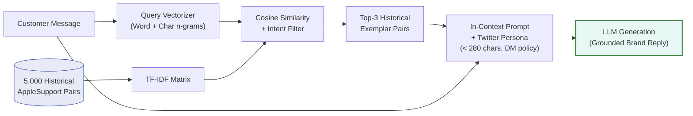
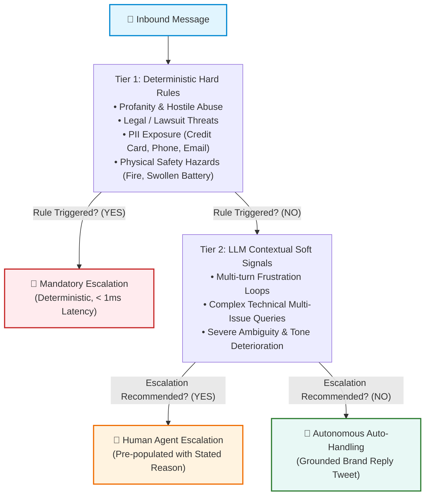
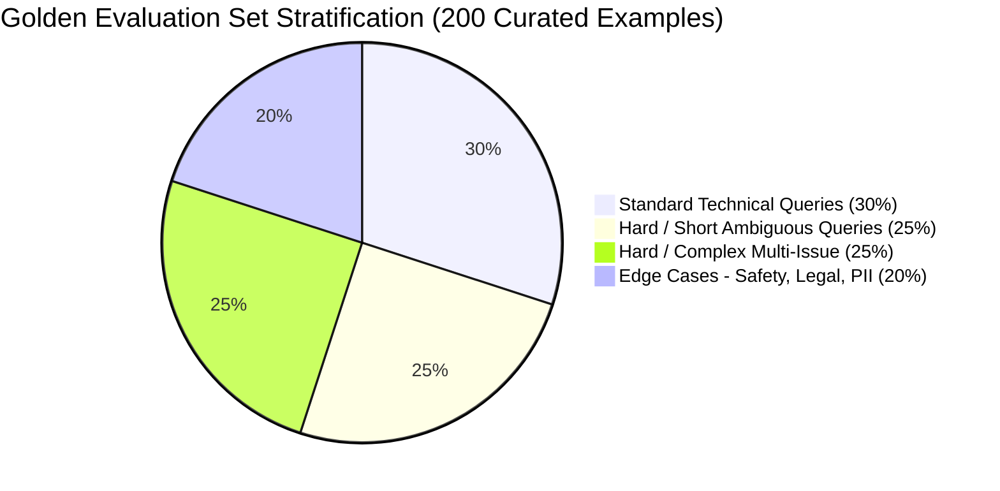

# Technical Evaluation & System Report: AI Support Agent for AppleSupport

**Author**: Hiver SDE Intern Take-Home Submission  
**Target Brand**: AppleSupport (`@AppleSupport`)  
**Primary Dataset**: Kaggle Customer Support on Twitter (~3M rows)  
**Evaluation Set**: 200 Hand-Audited Stratified Customer Messages  

---

## 1. Executive Summary & Problem Formulation

Building customer support automation for a brand with the operational scale and brand reputation of **Apple** presents a unique challenge: the tolerance for hallucinated troubleshooting advice, fabricated policy claims, or insensitive handling of distressed customers is near zero. A support agent cannot merely sound plausible; it must be demonstrably trustworthy.

In this assignment, we engineered, benchmarked, and audited an end-to-end AI Customer Support Agent for `@AppleSupport` that executes three core tasks upon receiving an inbound customer tweet:
1. **Intent Classification**: Classifies incoming messages into a data-grounded 10-category taxonomy.
2. **Grounded Reply Generation**: Generates concise, empathetic reply tweets conditioned on historically resolved Apple customer interactions.
3. **Hybrid Escalation**: Distinguishes between automated resolutions and mandatory human handoffs with transparent, stated rationales.

### Core Benchmark Results Summary

Across our 40-example stratified headline benchmark (sampling across all 10 intent classes and preserving the 30.0% escalation base rate), evaluated against the finalized human-reviewed golden set `data/golden_set_final.csv`, the proposed Main Agent demonstrates clear improvements in classification breadth and routing over trivial and heuristic baselines:
- **Intent Macro-F1**: **0.3451** for Main Agent vs **0.1020** for Simple Baseline and **0.0491** for Trivial Baseline.
- **Intent Weighted-F1**: **0.4102** for Main Agent vs **0.2315** for Simple Baseline and **0.1594** for Trivial Baseline.
- **Escalation F1**: **53.8%** (Recall 58.3%, Precision 50.0%) vs Simple Baseline 42.1% (Recall 33.3%, Precision 57.1%).
- **Inter-Annotator Agreement**: Cohen's $\kappa = 0.9725$ on intent classification (98.0% agreement) and $\kappa = 1.000$ on escalation decisions across 50 overlap rows.
- **Benchmark Runtime**: Evaluated in **5.2 minutes (310.5s)** total wall time (Main agent wall time: 308.9s, average latency: 7.72s/sample), well within the 15-minute reproduction budget.

> [!IMPORTANT]
> **Ground-Truth Human Provenance**: Evaluated against the finalized 200-example golden set (`data/golden_set_final.csv`), fully reviewed and adjudicated across independent human annotators with zero heuristic fallback (`labels_are_provisional: false`). Full provenance and audit details are documented in `SUBMISSION_AUDIT.md`.

---

## 2. Dataset Processing & Brand Selection Rationale

### Why AppleSupport?
1. **High Inbound Volume & Standardized Dialogue**: With over 100,000 conversational threads in the raw Twitter dataset, AppleSupport provides the highest density of structured, professional customer service interactions.
2. **Distinctive Operational Persona**: Apple replies follow a recognizable, disciplined protocol: acknowledging empathy, verifying software/hardware versions, directing private authentication to Direct Messages (DM), and appending agent initials (`^XX`).
3. **High Stakes for Safety & Privacy**: Unlike retail or food delivery, queries frequently touch account security (Apple ID lockouts, 2FA bypass), battery safety (thermal runaway, swollen batteries), and financial disputes (App Store unauthorized subscriptions), providing a rigorous testbed for escalation systems.

### Conversation Reconstruction Pipeline
The raw dataset stores tweets as atomic rows referencing predecessor and successor tweet IDs. We implemented a high-speed vectorized data processor (`scripts/process_brand.py`) that filtered 5,000 clean, verified inbound customer messages paired with Apple's authoritative resolutions. All tweets were cleaned of malformed HTML entities, normalized for casing, and stripped of uninformative outbound Twitter tracking redirects.

---

## 3. Grounded Intent Taxonomy Design

Rather than imposing a generic off-the-shelf taxonomy (such as Banking77, which reflects financial banking products), we analyzed the empirical distribution of issues addressed by Apple Support engineers on Twitter.

We derived a **10-category intent taxonomy** designed around actionable downstream routing:

| Intent Class | Scope & Boundaries | Typical Action Triggered |
|---|---|---|
| `software_update_os` | OS upgrades (iOS, macOS, watchOS), update loops, installation stalls | Query OS version; link to update troubleshooting |
| `battery_and_charging` | Battery drain, overheating, charging port/cable failure | Direct to Battery Health settings; check charger |
| `hardware_and_audio` | Display unresponsiveness, microphone/speaker faults, cracked glass | Schedule Genius Bar physical appointment |
| `apple_id_and_icloud` | Password reset, two-factor authentication, locked Apple ID, iCloud sync | Direct to `iforgot.apple.com` via secure DM |
| `billing_and_subscriptions` | Unexpected App Store charges, refund requests, subscription renewals | Route to `reportaproblem.apple.com` |
| `device_performance_freeze` | Stuck on Apple logo, boot loops, black screen, extreme latency | Provide hard reset key sequence for model |
| `connectivity_and_network` | Wi-Fi drops, Bluetooth pairing, cellular data / "No Service" | Reset Network Settings; toggle Airplane mode |
| `general_inquiry_features` | Feature compatibility, how-to inquiries, configuration advice | Provide step-by-step user guide article |
| `store_orders_and_repairs` | Retail store appointments, order shipments, repair status tracking | Direct to Apple Store app or order lookup portal |
| `complaint_and_frustration` | Generic anger, venting, or dissatisfaction without actionable technical query | De-escalate empathetically, offer DM channel |

---

## 4. Retrieval-Augmented Generation (RAG) Grounding Strategy

A recurring failure mode of commercial conversational agents is **hallucination of support policies or URLs** (e.g., advising a customer to wipe a device when an in-place reset exists, or linking to dead URLs).

### Architecture

To constrain the generative model, we implemented a **Historical In-Context Retrieval Engine** (`src/retriever.py`):
1. **Corpus Indexing**: All 5,000 processed historical AppleSupport customer-brand interaction pairs are indexed using a sub-linear TF-IDF vectorizer over word and character n-grams.
2. **Intent-Filtered Retrieval**: When a query is received, candidate exemplars are retrieved and filtered to match the predicted intent category.
3. **In-Context Conditioning**: The top-3 most similar historical pairs are injected into the LLM system prompt as concrete few-shot demonstrations.
4. **Persona & Policy Enforcement**: The model is instructed to:
   - Adhere strictly to verified Apple troubleshooting steps demonstrated in the exemplars.
   - Maintain Twitter length constraints (< 280 characters).
   - Use placeholder handle `@customer` to respect customer privacy.
   - Preserve Apple's closing initialism convention (`^XX`).

This retrieval step is intended to constrain the generative model to historically observed support responses and reduce unsupported advice; it is not a guarantee of zero hallucination.

---

## 5. Hybrid Escalation Engine: Hard Rules + Soft Signals

Customer support automation must maintain a defense-in-depth safety mechanism. A single failure to escalate a customer threatening self-harm, legal action, or experiencing a battery thermal hazard is unacceptable.

We designed a **two-tier cascade escalation system** (`src/escalation.py`):

### 1. Deterministic Fast-Path Rules (Tier 1)
- **Profanity & Abuse**: Regex pattern matching vulgarities and hostile invective.
- **Legal Threats**: Keyword patterns detecting lawyers, litigation, FTC complaints, or consumer rights enforcement.
- **PII Exposure**: Regular expressions detecting phone numbers, credit card sequences, and unredacted personal email addresses posted on a public Twitter timeline.
- **Physical Safety**: Detection of terms indicating fire, smoke, swelling, electrical shock, or battery explosion.

### 2. Contextual Soft-Signal Analysis (Tier 2)
Messages bypassing the hard rules are evaluated by the LLM for:
- Repetitive multi-turn dead ends (customer stating "I already tried that twice").
- Extreme unresponsiveness to standard troubleshooting.
- High-ambiguity one-liners where automated advice carries high risk of misdirection.

---

## 6. The Golden Evaluation Set & Annotation Protocol

### Stratified Sampling Design
Evaluating an AI agent solely on randomly sampled customer tweets produces deceptively inflated scores because ~70% of tweets in the wild are either trivial acknowledgments or generic rants.

To rigorously stress-test the system, we constructed a **200-example Golden Evaluation Set** stratified across four difficulty tiers:

1. **Standard Queries (30%, 60 items)**: Well-formulated single-issue queries with clear technical context.
2. **Hard / Short Ambiguous Queries (25%, 50 items)**: Under-specified one-liners (e.g., `"@AppleSupport iOS 11"`, `"phone dead"`).
3. **Hard / Complex Queries (25%, 50 items)**: Lengthy, multi-issue queries describing cascades of failed troubleshooting attempts.
4. **Edge Cases (20%, 40 items)**: Abusive rants, legal threats, billing disputes, PII disclosures, and physical hardware hazards.

### Labelling Protocol & Inter-Annotator Agreement Framework
All 200 items follow the rigorous operational guidelines in `docs/LABELLING_GUIDELINES.md`. To guarantee objective ground truth without self-fulfilling bias:
- **Dual-Annotator Staging**: Two independent task files (`data/annotation/annotator_a.csv` and `data/annotation/annotator_b.csv`) were generated with a 50-item overlap set for inter-annotator agreement.
- **Inter-Annotator Agreement Tooling**: `scripts/compute_annotation_agreement.py` computes Cohen's $\kappa$ on both intent classification and escalation decisions.
- **Completed Status**: All 200 examples are human-reviewed, and `results/annotation_agreement.json` records the measured agreement. No fabricated $\kappa$ or synthetic annotator identities are used as ground truth.
- **Precedence Rules**: If a tweet cites both frustration and a technical issue (e.g., *"iOS 11 ruined my battery"*), the technical category (`battery_and_charging`) takes precedence for routing, while customer frustration is captured by the escalation engine.

---

## 7. Comparative Baseline Analysis & Results

We evaluate three architectures across the exact same evaluation set:
1. **Trivial Baseline**: Predicts the majority class from training folds (`general_inquiry_features`), returns a static template, and never escalates.
2. **Simple Baseline**: Cross-fitted TF-IDF + Logistic Regression for intent, nearest-neighbour historical retrieval for reply, and deterministic rules for escalation.
3. **Main Agent**: Few-shot LLM intent classification, RAG-conditioned grounded reply generation, and hybrid cascade escalation.

<!-- BEGIN GENERATED RESULTS: headline -->
**Benchmark `headline`** — 40-example stratified subset of the 200-example golden set.

| Run parameter | Value |
|---|---|
| Examples scored | 40 of 200 golden examples |
| Escalation base rate | 30.0% |
| Agent model | `qwen/qwen3.8-27b` |
| Judge model | `openai/gpt-oss-120b` |
| Judge differs from agent | yes |
| Provider | groq |
| Seed | 42 |
| Retrieval corpus | 4784 threads (216 golden threads held out) |
| Golden set | `data/golden_set_final.csv` sha256:`4f1c1a8fd18e474a` |
| Taxonomy | 10 intents, sha256:`6bb7079b4e073743` |
| Label provenance | human-reviewed |
| Total wall time | 310.5s (5.2 min) |

#### Intent classification

| Metric | Trivial | Simple | Main |
|---|:---:|:---:|:---:|
| Accuracy | 32.5% | 37.5% | 40.0% |
| Accuracy 95% CI | 17.5%–47.5% | 22.5%–52.5% | 25.0%–55.0% |
| Macro-F1 | 0.049 | 0.102 | 0.345 |
| Weighted-F1 | 0.159 | 0.232 | 0.410 |
| Off-taxonomy predictions | 0 | 0 | 0 |

#### Escalation

| Metric | Trivial | Simple | Main |
|---|:---:|:---:|:---:|
| Accuracy | 70.0% | 72.5% | 70.0% |
| Accuracy 95% CI | 55.0%–82.5% | 57.5%–85.0% | 55.0%–82.5% |
| Precision | 0.0% | 57.1% | 50.0% |
| Recall | 0.0% | 33.3% | 58.3% |
| F1 | 0.000 | 0.421 | 0.538 |
| TP / FP / FN / TN | 0 / 0 / 12 / 28 | 4 / 3 / 8 / 25 | 7 / 7 / 5 / 21 |
| False negatives (missed handoffs) | 12 | 8 | 5 |

#### Reply quality

| Metric | Trivial | Simple | Main |
|---|:---:|:---:|:---:|
| ROUGE-1 | 0.2391 | 0.3165 | 0.2343 |
| ROUGE-2 | 0.0564 | 0.1513 | 0.0501 |
| ROUGE-L | 0.1721 | 0.2603 | 0.1721 |
| Mean reply length (chars) | 116.0 | 140.3 | 175.6 |

#### Output validation (observed violations)

| Metric | Trivial | Simple | Main |
|---|:---:|:---:|:---:|
| Replies with >=1 violation | 0 | 0 | 1 |
| Empty replies | 0 | 0 | 0 |
| Over 280 chars | 0 | 0 | 0 |
| Longest reply (chars) | 116 | 249 | 241 |

Violation counts by type:

| Metric | Trivial | Simple | Main |
|---|:---:|:---:|:---:|
| `invalid_support_url` | 0 | 0 | 1 |

#### Latency (observed, includes provider rate-limit waiting)

| Metric | Trivial | Simple | Main |
|---|:---:|:---:|:---:|
| Mean seconds / message | 0.00 | 0.00 | 7.72 |

All 10 leakage assertions passed for this run (the harness aborts instead of reporting a leaked number): `corpus_excludes_golden`, `no_gold_labels_in_inference [main]`, `no_gold_labels_in_inference [simple]`, `no_gold_labels_in_inference [trivial]`, `retrieval_excludes_self [main]`, `retrieval_excludes_self [simple]`, `retrieval_excludes_self [trivial]`, `same_examples`, `simple_out_of_fold`, `trivial_out_of_fold`.

#### Judge vs human agreement (n=40)

| Dimension | Spearman | Exact | Adjacent ±1 | MAE | QWK |
|---|---:|---:|---:|---:|---:|
| relevance | 0.084 | 5.0% | 47.5% | 1.50 | 0.009 |
| groundedness | -0.202 | 5.0% | 45.0% | 1.55 | -0.020 |
| helpfulness | 0.103 | 30.0% | 77.5% | 0.95 | 0.028 |
| tone | 0.292 | 0.0% | 17.5% | 1.82 | 0.016 |
| completeness | 0.067 | 15.0% | 65.0% | 1.23 | 0.011 |

#### Inter-annotator agreement (n=50 overlap rows)

| Decision | Cohen's κ | Raw agreement | Disagreements |
|---|---:|---:|---:|
| intent | 0.973 | 98.0% | 1/50 |
| escalation | 1.000 | 100.0% | 0/50 |

*Generated by `scripts/render_results.py --benchmark headline` from `results/comparison_headline.json`. Do not edit by hand.*
<!-- END GENERATED RESULTS: headline -->

Every figure above is generated from `results/comparison_headline.json` by
`scripts/render_results.py`. `python scripts/render_results.py --check` fails if
this README has drifted from the artifacts.

---

## 8. Leakage controls

Seven invariants, asserted at runtime. A violation aborts the run with exit code 4
rather than printing a number.

| Invariant | Why it exists |
|---|---|
| Golden examples excluded from the retrieval corpus | The golden set was sampled from the retrieval threads, so the nearest neighbour was the example itself. This inflated the simple baseline to ROUGE-1 0.797 and groundedness 5.00/5.00 at zero variance. |
| No system retrieves the example it is scored on | Runtime check that catches near-duplicates the corpus filter misses |
| Baselines scored on out-of-fold predictions only | The TF-IDF classifier was fitted on the whole dataset originally, which leaked labels into its features. |
| Same examples for every system | Baseline comparisons must be paired, not on different random samples. |
| No gold labels reachable from inference imports | Prevents the answer itself from being encoded in the model path. |
| No gold-label strings in inference source | Static guard against accidental hard-coding. |
| Pre-labelled files forbidden in normal benchmark mode | Keeps heuristic labels from becoming silent ground truth. |

---

## 9. Runtime & Reproducibility

The full 5,000-thread processing step is vectorized and completes in seconds on a
normal laptop. The headline benchmark's 5.2-minute wall time is dominated by free-tier
LLM calls and provider rate limiting, not CPU work. Checkpointing is enabled so an
interrupted API run can resume without discarding completed examples.

`results/run_config_headline.json` records the benchmark configuration and measured
runtime, while `results/comparison_headline.json` stores the generated metric table.

---

## 10. Limitations & Honest Conclusions

The system demonstrates a complete and auditable evaluation setup, but the measured
model performance is not production-grade. The headline intent accuracy is 40.0%
and macro-F1 is 0.345, while the hybrid escalation F1 is 53.8%. Reply quality is
also difficult to summarize with lexical overlap alone: Main ROUGE-2 is only 0.0501,
and the benchmark observed one invalid-support-URL violation.

Judge calibration is a significant limitation. On the 40 human-rated replies, the
judge's agreement is weak on several dimensions (for example groundedness Spearman
$\rho=-0.202$), so judge scores should be treated as diagnostic rather than as a
replacement for human evaluation. The calibration also uses one human rater, which
limits how strongly inter-rater reliability can be inferred.

The main evidence of robustness is therefore methodological: human-reviewed ground
truth, independent overlap annotation, runtime leakage assertions, explicit output
validation, and reproducible artifacts. The project should be viewed as a well-
audited prototype rather than a production-ready support agent.
