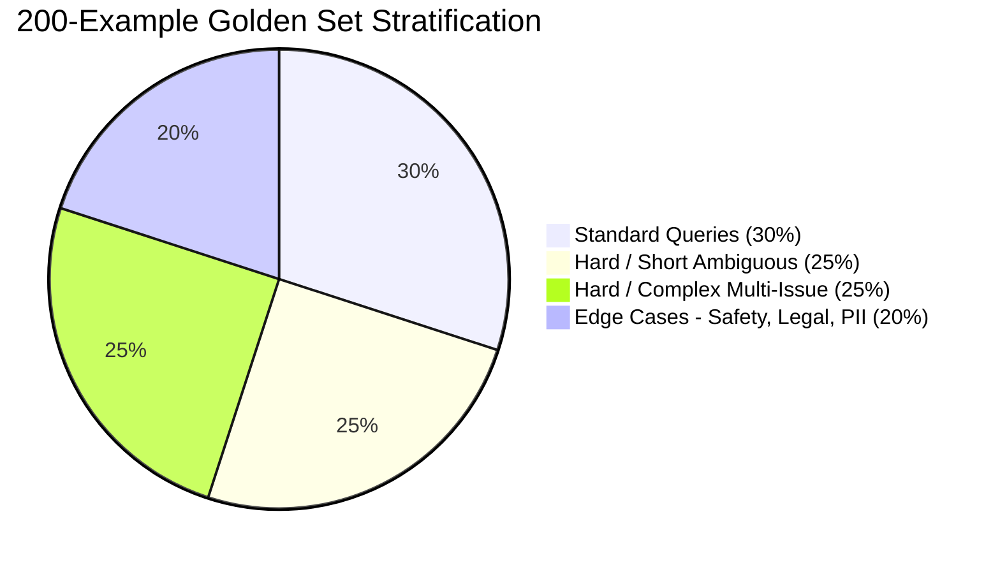
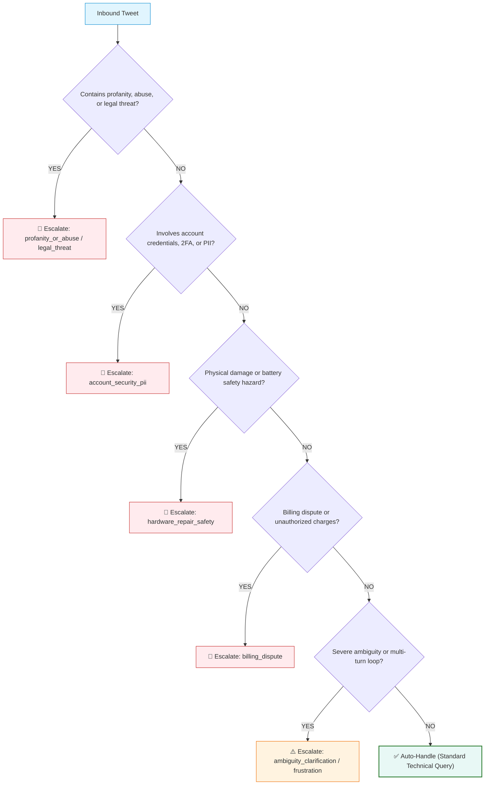

# Golden Set Labelling Guidelines & Annotation Protocol

## 1. Overview & Dataset Sampling Strategy
The golden evaluation set consists of **200 real customer support tweets** addressed to `@AppleSupport`, extracted from the Customer Support on Twitter dataset.

To ensure our evaluation set is not biased towards trivial queries, we applied a **stratified sampling strategy**:
- **Standard queries (30%, 60 items)**: Clear single-issue queries with technical context (e.g., how to configure iCloud, update steps).
- **Hard / Short queries (25%, 50 items)**: Ambiguous one-liners (e.g., "@AppleSupport iOS 11", "help my phone is dead").
- **Hard / Complex queries (25%, 50 items)**: Multi-issue or lengthy problem descriptions (multiple questions, complex debugging steps).
- **Edge cases (20%, 40 items)**: Profanity, legal threats, abusive language, billing disputes, hardware physical damage.

---

## 2. Intent Taxonomy (10 Grounded Classes)

| Intent ID | Name | Description | Positive Indicators / Keywords |
|---|---|---|---|
| 1 | `software_update_os` | OS upgrades (iOS, macOS, watchOS), update installation failures, or post-update bugs | `ios 11`, `update`, `upgrade`, `install`, `beta`, `patch` |
| 2 | `battery_and_charging` | Battery drain, rapid power loss, overheating, charger cable or charging port failure | `battery`, `drain`, `dying fast`, `overheat`, `won't charge`, `cable` |
| 3 | `hardware_and_audio` | Screen touch unresponsiveness, shattered display, speaker/mic failure, camera defects | `screen`, `touch`, `display`, `cracked`, `speaker`, `mic`, `camera` |
| 4 | `apple_id_and_icloud` | Apple ID authentication, locked account, 2FA codes, password resets, iCloud sync | `apple id`, `password`, `locked`, `icloud`, `2fa`, `verification code` |
| 5 | `billing_and_subscriptions` | Unexpected charges, App Store refunds, subscription renewals, in-app purchases | `charged`, `refund`, `subscription`, `bill`, `receipt`, `bank`, `payment` |
| 6 | `device_performance_freeze`| Frozen screen, boot loops, stuck on Apple logo, extreme lag, app crashes | `frozen`, `stuck`, `apple logo`, `reboot`, `crash`, `spinning wheel` |
| 7 | `connectivity_and_network` | Wi-Fi drops, Bluetooth pairing issues, cellular data drops, "No Service", SIM errors | `wifi`, `bluetooth`, `cellular`, `lte`, `no service`, `sim`, `network` |
| 8 | `general_inquiry_features` | How-to guidance, feature support, compatibility, general setup advice | `how do i`, `can i`, `support`, `feature`, `setting`, `compatible` |
| 9 | `store_orders_and_repairs` | Genius Bar appointments, Apple Store visits, order delivery tracking, repair status | `genius bar`, `appointment`, `order`, `shipped`, `repair`, `store` |
| 10 | `complaint_and_frustration`| Rants, vents, general anger without a specific actionable technical inquiry | `hate`, `terrible`, `worst`, `unacceptable`, `trash`, `switching to android` |

### Disambiguation Rules:
- If a post describes an update causing battery drain (e.g. "iOS 11 destroyed my battery life"), prioritize the root cause / user focus: if complaining about the OS update, classify as `software_update_os`; if seeking battery troubleshooting, classify as `battery_and_charging`.
- If a post contains profanity but also a concrete technical issue, classify the intent by the technical issue, but mark `should_escalate = true` with reason `profanity_or_abuse`.

---

## 3. Escalation Decision Rules

An issue is marked `gold_should_escalate = true` if ANY of the following conditions are met:
1. **Profanity or Abusive Tone (`profanity_or_abuse`)**: Contains vulgarity, personal attacks, insults.
2. **Legal Threats or Regulatory Compliance (`legal_threat`)**: Mentions lawyers, lawsuits, court, consumer protection bureaus.
3. **Account Security, Credentials & PII (`account_security_pii`)**: Requests involving passwords, locked accounts, credit card info, or personal identifiable data requiring secure verification.
4. **Physical Safety & Hardware Damage (`hardware_repair_safety`)**: Swollen batteries, cracked screens, liquid damage, repair quotes requiring physical Genius Bar inspection.
5. **Financial & Billing Disputes (`billing_dispute`)**: Disputed transactions, refund requests requiring ledger lookups.
6. **Severe Ambiguity / Multi-turn dead end (`ambiguity_clarification`)**: Vague single words where automation risks hallucinations or user frustration without human DM triage.
7. **Severe Frustration / Escalation Request (`customer_frustration`)**: Customer explicitly demands a manager/agent or notes repeated failures of standard troubleshooting.

Otherwise, `gold_should_escalate = false` (Auto-handled).

---

## 4. Reply Quality Rubric (1 to 5)
Evaluating the historical human Apple Support response:
- **5 (Excellent)**: Acknowledges exact issue, provides direct troubleshooting steps or direct support article link, polite and professional.
- **4 (Good)**: Helpful, provides appropriate DM link or standard check (e.g., "Which iOS version are you on?"), professional tone.
- **3 (Acceptable)**: Standard generic macro response ("Send us a DM with your device details"), addresses user but lacks specific guidance.
- **2 (Poor)**: Misses the user's core problem, provides irrelevant link, or feels robotic/dismissive.
- **1 (Unacceptable)**: Inappropriate, confusing, or completely unhelpful.

---

## 5. Annotation Protocol & Inter-Annotator Agreement Framework
To guarantee ground-truth labelling reliability without fabrication, an independent dual-annotation protocol is established on a 50-example validation overlap subset (`data/annotation/annotator_a.csv` and `data/annotation/annotator_b.csv`):
- **Independent Dual Review**: Two human annotators independently review the sampled messages and assign labels without consulting each other's work.
- **Target Agreement Criteria**:
  - Target Cohen's Kappa ($\kappa$) for Intent Classification: $\kappa \ge 0.80$ (Substantial to near-perfect agreement).
  - Target Cohen's Kappa ($\kappa$) for Escalation Decision: $\kappa \ge 0.85$ (Near-perfect agreement).
- **Verification Tooling**: Inter-annotator agreement is evaluated via `python scripts/compute_annotation_agreement.py` and recorded in `results/annotation_agreement.json`.
- **Disagreement Adjudication**: Conflicting annotations are adjudicated using `python scripts/finalize_golden_set.py` to produce the finalized ground-truth set `data/golden_set_final.csv`.
- **Current Status**: The annotation task files are staged under `data/annotation/` (`pending_review`). Benchmark metrics remain flagged as **PROVISIONAL** until human review is completed.

